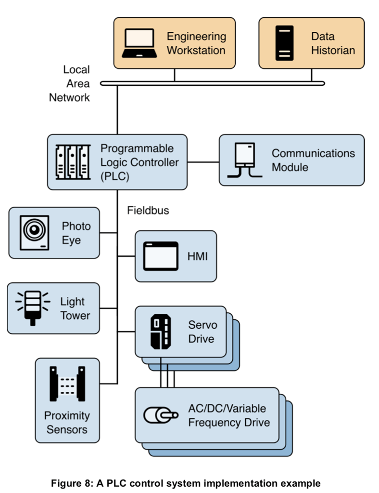
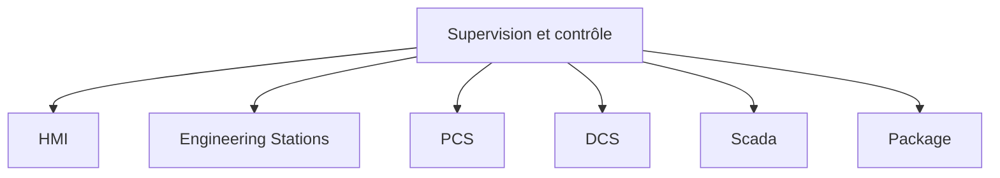
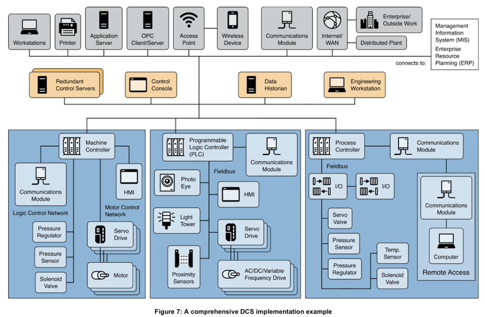
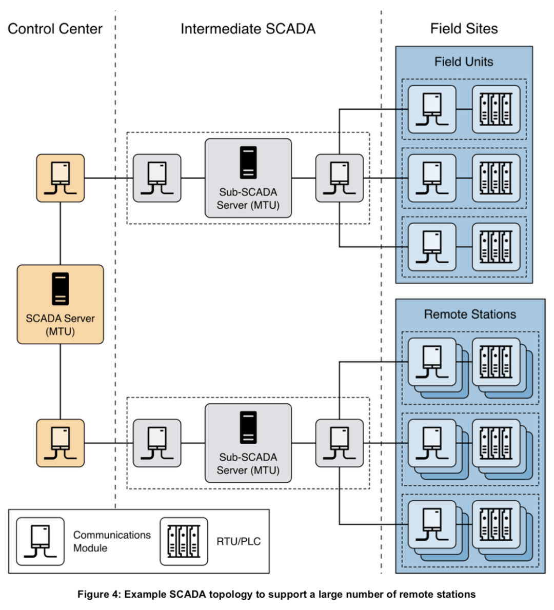

# SI Industriel

## Controlled Process

- Procédé physique réalisant une activité (ex. chaudière industrielle).
- **Entrées/Sorties (Inputs/Outputs)** : carburant et eau froide en entrée ; gaz de combustion et eau chaude en sortie.
- **Perturbations** : facteurs extérieurs comme la température et le vent.
- **Capteurs (Sensors)** : mesurent l'état du procédé (ex. température de l'eau).

## Contrôleur (Controller)

- Compare la valeur mesurée par les capteurs à la **consigne (Setpoint)**, ex. 70°C.
- Décide des actions à envoyer aux **actionneurs (Actuators)** selon l'écart entre consigne et mesure.
- **Remote Diagnostics and Maintenance** : diagnostics sur le contrôleur, capteurs et actionneurs en cas de dysfonctionnement.

## Types d'Assets dans l'OT

| Type | Description |
| --- | --- |
| **BMS** (Building Management System) | Gestion des bâtiments (ventilation, ascenseurs). |
| **Capteurs & Actionneurs** | Interagissent avec le monde physique et transmettent les données aux systèmes de contrôle. |
| **Automatismes** | Pilotes des procédés industriels, traduisant des mesures physiques en données interprétables. |
| **PLC** (Programmable Logic Controller) | Automate programmable pilotant des processus industriels en temps réel. |

## BMS (Building Management System)

- **Synonymes** :
  - **BMS** : Building Management Systems
  - **BAS** : Building Automation Systems
  - **GTB** : Gestion Technique des Bâtiments
- Les BMS représentent les équipements servant à opérer des locaux administratifs ou industriels.
- **Exemples d'applications** :
  - Ventilation
  - Chauffage et climatisation (**HVAC** : Heating Ventilation and Air Conditioning)
  - Ascenseurs
  - Détection incendie
  - Gestion de l'énergie
  - Éclairage
  - Système de contrôle d'accès
  - Vidéosurveillance
- **Débat** : Certains estiment que la vidéosurveillance et le contrôle d'accès ne font pas partie du BMS, d'autres oui. Peu importe, ces systèmes doivent avoir un périmètre désigné et une cybersécurité adéquate.
- **Problème de gestion** : Les BMS sont souvent des systèmes "orphelins" ou non attribués dans les périmètres IT et OT, car ils ne sont ni des PC bureautiques ni des équipements de production. Ils doivent être attribués à un "asset owner" et être managés pour éviter les assets orphelins.

## PLC : Programmable Logic Controller

- Pilotage des processus industriels en temps réel.
- Envoi des ordres aux préactionneurs (côté actionneur) à partir des capteurs (côté capteur).
- **APS** (Automate Programmable de Sécurité) : PLC remplissant une fonction de sécurité industrielle.

## RTU (Remote Terminal Unit)

- Caractéristiques similaires à un PLC avec tolérances environnementales plus élevées.
- Utilisation à grande distance, pouvant être alimenté par batterie.
- **Exemple** : Démarrage à distance d'un système de production d'électricité.

## IED (Intelligent Electronic Device)

- Dispositif électronique pré-programmé avec entrées/sorties.
- Utilisé principalement dans le domaine de l'énergie (ex. synchronisation GPS).

## Systèmes de Sécurité (SIS)

- Maintient le procédé dans un état sécurisé.
- Réactions possibles en cas de comportement anormal :
  - Procédé simple : arrêt.
  - Procédé complexe : stabilisation.
- **Niveau d'intégrité de sécurité (SIL)** : Performance des fonctions de sécurité (de 1 à 4).

## Exemple de Scénario sur les Risques de Sécurité

- Capteur défaillant transmettant une valeur incorrecte (3 bars au lieu de 4).
- Défaillance conduisant à une surpression et à une explosion, causant des dégâts environnementaux et humains.
- **Solution** : Systèmes de sécurité renforcés (capteurs et actionneurs redondants, automate safety).

## Data Historian

- Le **Data Historian** est une base de données qui centralise et stocke les données process datées (valeurs, événements, alarmes) et environnementales d'un procédé industriel.
- **Utilisations principales** :
  - Visualisation / surveillance du procédé (IHM en salle de conduite).
  - Consultation des données archivées pour diagnostic (visualiser à posteriori une partie du process par l'ingénieur d'exploitation).
  - Utilisation des données pour optimisation de l'exploitation et de la maintenance (statistiques de pannes, corrélation d'informations, etc.).
  - Réglementaire : Traçabilité sur une longue période (ex. 10 dernières années) du comportement process ou des rejets environnementaux.
- Plusieurs **Data Historians** peuvent exister dans un système d'information industriel :
  - Celui intégré dans le SCADA (historisation sur des périodes courtes).
  - Celui qui historise plusieurs procédés et conserve des données à plus long terme.
- **Exemples d'éditeurs** : Osisoft, Aspentech.

## Autres Équipements

- **PC de laboratoires ou LIMS (Laboratory Information Management System)**
- **PC de contrôle qualité**
- Ces équipements peuvent être installés sur le réseau IT ou OT selon leur fonctionnalité. Exemple : un PC de contrôle qualité d'une fibre en production devrait être sur le réseau OT.

## Perspectives d'avenir et Industrie 4.0

- **Évolution des technologies** offrant de nouvelles perspectives aux systèmes d'information industriels :
  - Protocoles réseaux sans fil (5G, RFID, Lora, Bluetooth, Zigbee, etc.)
  - Nouvelles architectures cloud et offres de service associées, Big Data / Data Analytics
  - Intelligence artificielle
  - **Internet of Things (IoT)**
- Ces technologies augmentent la productivité mais ouvrent aussi l'exposition des systèmes sur Internet, posant des risques de **Shadow IT**. Certaines entreprises pourront tirer parti de ces technologies pour survivre, tandis que d'autres pourraient trouver les risques trop élevés.

## Supervision et Contrôle

| Type | Description |
| --- | --- |
| **HMI/IHM** | Interface utilisateur pour superviser et piloter les systèmes de contrôle. Utilisée pour communiquer avec les systèmes de contrôle industriels (PLC, RTU, etc.). Fonctions principales : superviser le procédé (visualiser les valeurs, les alarmes), piloter le procédé (valider des actions, saisir des consignes). En cas de panne de l'IHM, le procédé peut passer en mode dégradé. |
| **Engineering Workstations** | Stations d'ingénierie pour créer/modifier les programmes automates ou paramétrer des ICS. Équipées de logiciels propriétaires, gestion de configuration, descriptifs fonctionnels, droits/privilèges élevés. Fréquemment utilisées pour réaliser des diagnostics en cas de dysfonctionnement. |
| **PCS/PBCS** | Ensemble d'équipements (HMI, Engineering workstation, PLC, etc.) supervisant/pilotant un procédé industriel. |
| **DCS** (Distributed Control System) | Contrôle des procédés industriels complexes sur un même site géographique, composé de plusieurs PCS. Utilisé dans des usines comme les raffineries, traitement des eaux, production d'électricité. |
| **SCADA** | Supervision à grande échelle, traitant un grand nombre de télémesures en temps réel et contrôlant à distance des installations techniques. Domaines d'application : réseaux électriques, transport de produits chimiques, gaz, eau, transports ferroviaires, aériens, maritimes. |
| **Package** | Ensemble complet (contrôle commande + mécanique) réalisant une fonction de process industriel. Fréquemment utilisé dans les process Oil and Gas, fourni clé en main avec tous les composants nécessaires. |

### DCS

### SCADA

## Les Opérations de Maintenance

- Un élément important sur une installation industrielle est la partie maintenance afin de garantir une continuité de service nécessaire.
- **Gestion de la maintenance** :
  - Beaucoup d'équipements ayant été installés et achetés à des fournisseurs différents, la maintenance associée doit être gérée de manière efficace.
- **Types de maintenance** :
  - **Internalisée** :
    - Équipes de maintenance faisant partie de l'entreprise.
    - Équipe locale pour des interventions rapides, et équipes centralisées pour des couches hautes du SI industriel (ex. Data Historian) avec accès à distance.
  - **Externalisée** :
    - Maintenance confiée à un prestataire externe en cas de manque de ressources ou compétences spécifiques.
    - Interventions planifiées (maintenance préventive) ou en urgence (maintenance curative), réalisées sur site ou à distance.
  - **Contrat de maintenance** : Un contrat doit exister entre l'entreprise et le sous-traitant.

## Les Acteurs OT

- **Directeur de site** : Responsable de toute l'activité du site. En cas d'incident impactant les vies humaines ou l'environnement, il est le premier responsable.
- **Responsable automation** : Responsable des installations de contrôle commande (capteurs/actionneurs/ICS). Gère la base installée, les projets associés et la maintenance de son périmètre.
- **Ingénieur d'exploitation** : Définit et maîtrise le procédé de fabrication, propose des modifications pour un fonctionnement optimal. Peut réaliser des modifications de paramétrage des systèmes de contrôle commande.
- **Développeur ICS Contrôle commande** : Développe et paramètre les applications des automates et ICS selon un cahier des charges fonctionnel et technique.
- **Technicien / Responsable de maintenance** : Responsable de la maintenance des installations industrielles. Réalise la maintenance préventive (interventions périodiques) et curative (interventions en cas de panne).
- **Opérateur de conduite** : Pilote le procédé et intervient en cas de dysfonctionnement pour sécuriser l'installation. Consigne les modifications de procédé et événements anormaux.
- **Ingénieur de sûreté** : Évalue l'état de sûreté et prend les dispositions nécessaires pour garantir la sûreté des installations. Impliqué dans les analyses de risques (y compris cyber).
- **Responsable de la cybersécurité industrielle** : Définit et applique les règles de cybersécurité sur le périmètre industriel. Peut être un rôle dédié ou partagé avec le responsable automation selon la taille de l'installation.

## Maintenance industrielle

La **maintenance** est essentielle pour garantir la continuité de service sur une installation industrielle. Elle peut être de deux types :

1. **Internalisée** :
   - Maintenance effectuée par les équipes internes de l'entreprise.
   - **Équipe locale** : Interventions rapides grâce à la proximité.
   - **Équipe centralisée** : Pour les grandes infrastructures, souvent sur les couches hautes du système (comme le **Data Historian**), utilisant un **accès distant**.

### Types de maintenance

- **Préventive** : Interventions régulières pour éviter les pannes (ex : nettoyage de ventilateurs, check de disque dur, backup).
- **Curative** : Intervention suite à une panne (réparation).

2. **Externalisée** :

- Nécessaire en cas de manque de ressources locales ou de compétences spécifiques.
- Réalisée par des prestataires externes ou par les fournisseurs.
- Types de maintenance : **Préventive** (planifiée) ou **curative** (urgence).
- Contrats de maintenance doivent être établis entre l’entreprise et le sous-traitant.

## Acteurs OT

| Rôle                             | Description                                                                                 |
|----------------------------------|---------------------------------------------------------------------------------------------|
| **Directeur de site**            | Responsable de l'activité du site, impliqué en cas d'incidents affectant la sécurité.       |
| **Responsable automation**       | Gère les installations de contrôle commande et la maintenance des équipements associés.     |
| **Ingénieur d’exploitation**     | Définit le procédé de fabrication et propose des améliorations. Peut modifier les systèmes de contrôle. |
| **Développeur ICS**              | Développe et paramètre les applications pour automates et ICS. Utilise des spécifications techniques. |
| **Technicien/Responsable maintenance** | Maintenance préventive (prévenir les pannes) et curative (réparation après panne).   |
| **Opérateur de conduite**        | Supervise le procédé, intervient en cas de dysfonctionnement, consigne les événements.      |
| **Ingénieur de sûreté**          | Garantit la sûreté des installations, interagit avec l'ingénieur d’exploitation et la cybersécurité. |
| **Responsable cybersécurité industrielle** | Applique les règles de cybersécurité sur le site, rôle souvent partagé avec le responsable automation. |

