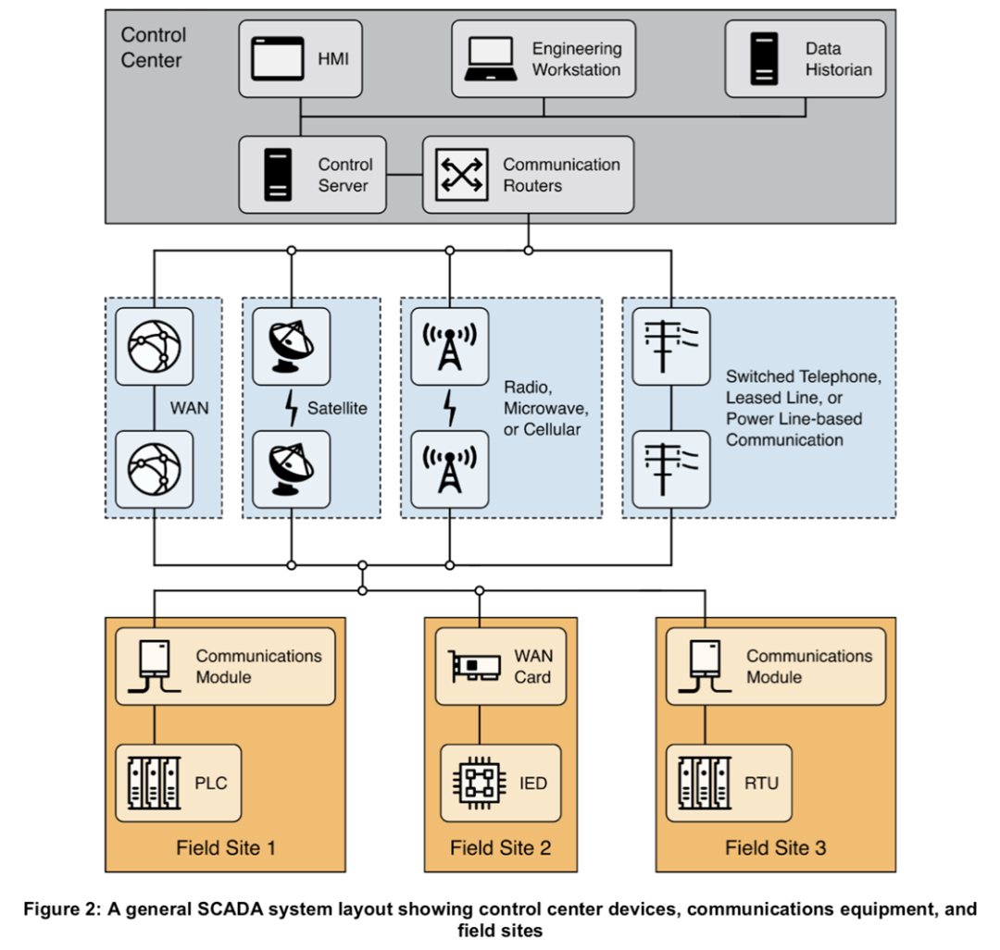
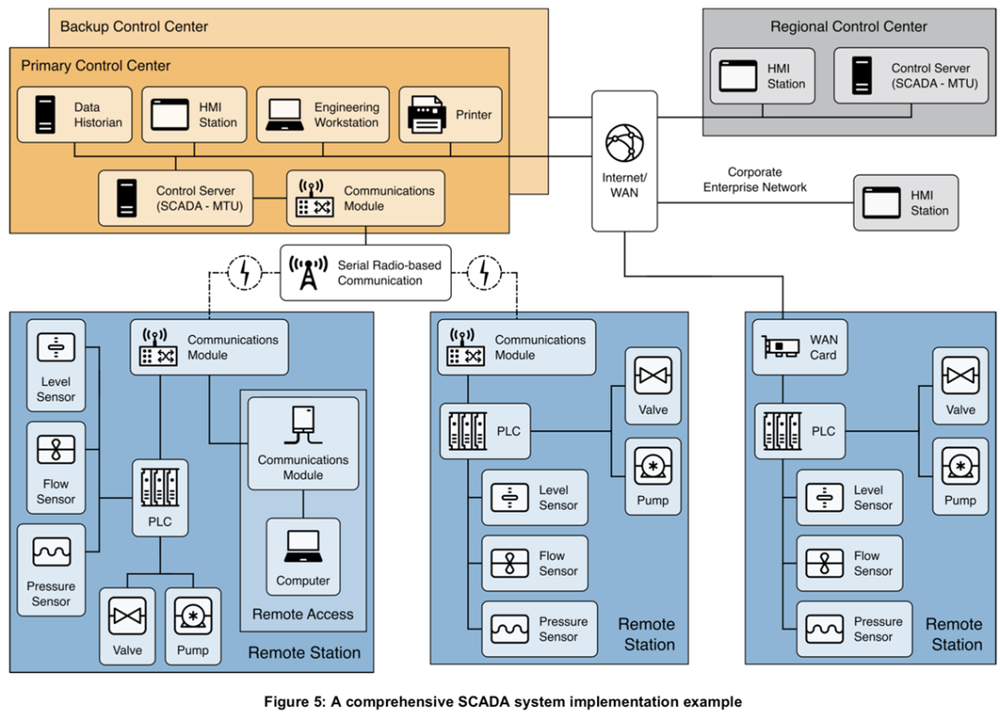
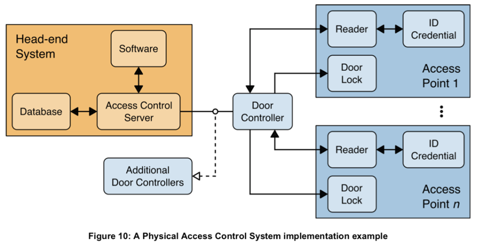
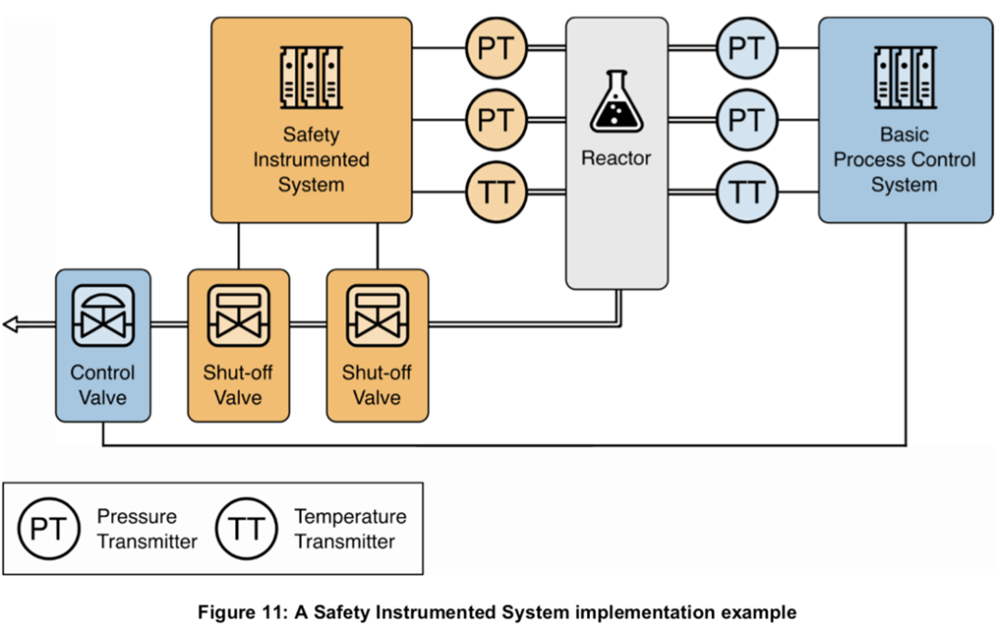
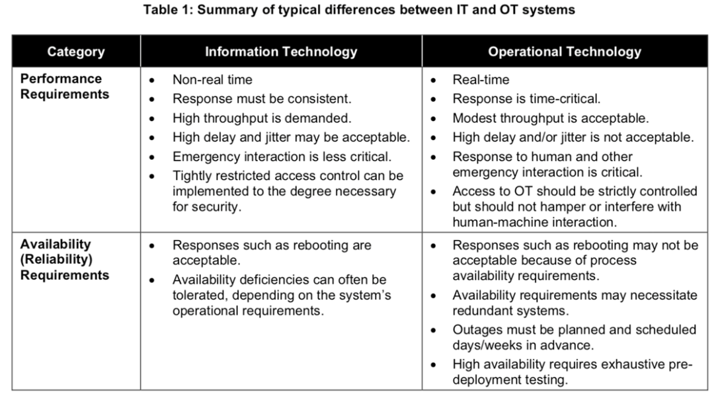
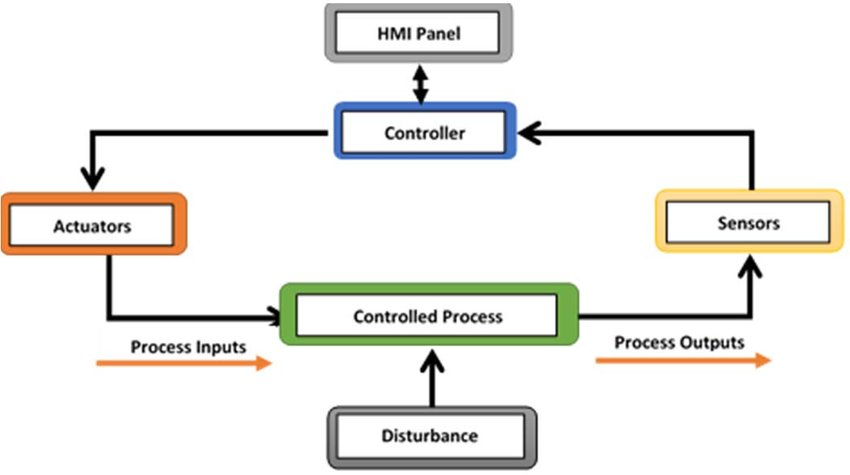
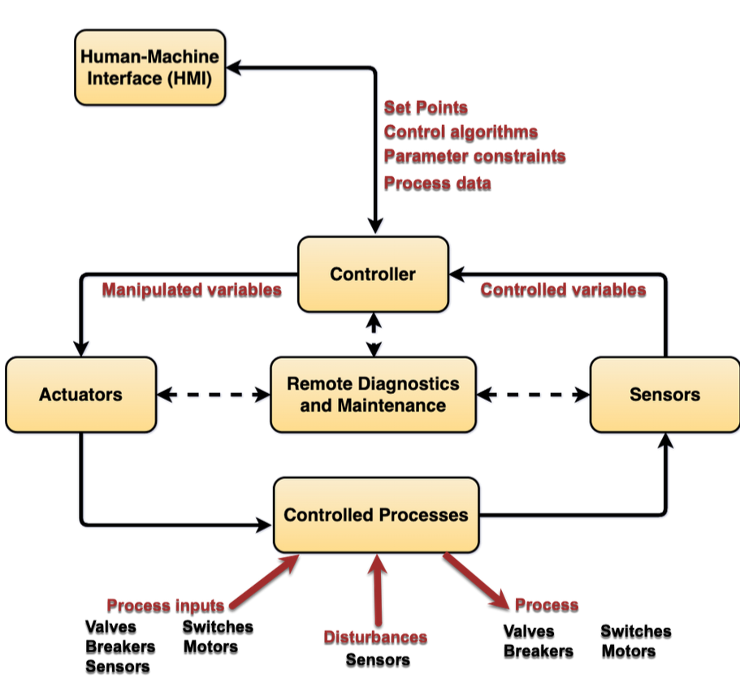
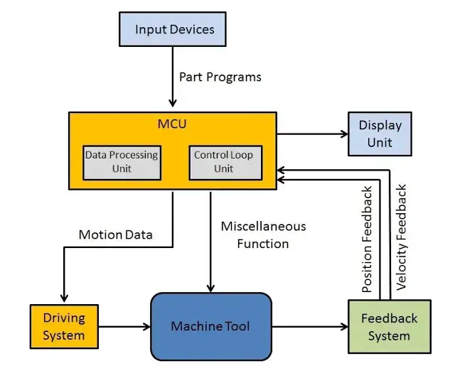

# Définition de l'OT (Operational Technology)

**Operational Technology (OT)** est l'ensemble des matériels et logiciels qui permettent de surveiller, contrôler, et automatiser les équipements industriels, actifs, processus et événements (définition GARTNER). En résumé, l'OT couvre tout ce qui est nécessaire pour piloter des opérations industrielles.

## Révolutions Industrielles et Industrie 4.0

L'histoire moderne est marquée par quatre révolutions industrielles successives :

1. **1ère révolution industrielle** : Apparue avec l'exploitation du charbon et la machine à vapeur (James Watt, 1769). Remplacement de l'artisanat par la production mécanique, entraînant l'industrialisation des usines.
2. **2ème révolution industrielle** : Utilisation du pétrole et de l'électricité à la fin du XIXe siècle. Développement du travail à la chaîne et du taylorisme, permettant la production en masse de produits identiques.
3. **3ème révolution industrielle** : Avènement de l'électronique, des télécommunications et de l'informatique au XXe siècle. Automatisation des tâches difficiles, introduction de la robotique, flexibilité des outils de production, et émergence des énergies renouvelables.
4. **4ème révolution industrielle** (Industrie 4.0) : Apparition de systèmes cyber-connectés. Accent mis sur la personnalisation des produits, intégration des nouvelles technologies, et interconnexion entre les collaborateurs, machines, et produits.

**Industrie 4.0** désigne une nouvelle génération d'usines connectées, robotisées et intelligentes. Cette industrie s'appuie sur la révolution numérique, amenuisant les frontières entre le monde physique et digital pour créer des usines interconnectées. Le terme est apparu pour la première fois en 2011 lors du Forum mondial de l'Industrie de Hanovre.

- Evolution des protocoles réseaux sans fil (5G, RFID, Lora, bluetooth, Zigbee, ...)
- Nouvelles architectures cloud et offres de service associées le big data / Data analytics

Malgré l'avènement de la 4ème révolution, de nombreux sites fonctionnent encore avec des systèmes hérités de la 3ème révolution, exposant ces équipements à de nouvelles vulnérabilités.

## Types de Process Industriels

Chaque système industriel effectue un **process**. Il existe deux grandes familles de processus :

- **CONTINU** : souvent appelé industrie de "Process", ce type est très majoritairement automatisé, avec des étapes enchaînées sans interruption. Utilisé dans la chimie, le traitement des eaux, le oil & gas, etc., il est adapté aux productions de forte capacité et volume.
- **DISCRET** : souvent appelé industrie de "Manufacturing", ce type est automatisé, répétitif et produit des unités identiques (ex. pièces automobiles, bouteilles en plastique). Par exemple, la fabrication de packaging de brique de lait suit plusieurs étapes successives (découpage, mise en forme, thermosoudage, etc.).

À partir de ces deux familles, on distingue également :

- **HYBRIDE** : combine des processus continus et discrets (ex. production de canettes de soda : discret pour le contenant, continu pour le contenu).
- **BATCH** : fabrique un produit à partir d'une recette et délivre des lots. Utilisé en chimie, production alimentaire et pharmaceutique.

| Type de Process | Description                                         | Exemples d'Industries                          |
|-----------------|-----------------------------------------------------|-----------------------------------------------|
| CONTINU         | Automatisé, étapes sans interruption                | Chimie, Oil & Gas, traitement des eaux        |
| DISCRET         | Répétitif, production d'unités identiques           | Automobile, emballage, électronique           |
| HYBRIDE         | Combinaison de Continu et Discret                   | Boissons (canettes + contenu), produits ménagers |
| BATCH           | Production par lots basés sur des recettes          | Alimentaire, chimie, pharmaceutique           |

## Domaines d'application de l'OT

L'OT est utilisé dans divers secteurs nécessitant des actions physiques sur notre environnement, tels que :

- **Production et distribution d'énergie**
- **Industrie manufacturière** : alimentaire, chimie, etc.
- **Secteur médical** : appareils connectés comme les scanners, radiologie
- **Traitement des eaux**
- **Signalisation routière et ferroviaire** : automatismes pour la fluidité et la sécurité du trafic
- **Gestion des bâtiments** : vidéosurveillance, contrôle d'accès, climatisation
- **Infrastructures de transport** : métro automatisé, bornes de recharge de véhicules électriques, aéroports (gestion des bagages)
- **Centrales nucléaires** et **réseau électrique** : pilotés par SCADA/RTU pour garantir la sûreté
- **Méthaniers** : équipements de chargement/déchargement et surveillance

En France, certains secteurs d'activité sont définis comme **d'Importance Vitale** (OIV) par le code de la défense et nécessitent une protection accrue de leur OT pour la survie de la nation. Ces secteurs incluent :

- **Humain** : alimentation, gestion de l'eau, santé
- **Régalien** : activités civiles et militaires de l'État, activités judiciaires
- **Économique** : énergie, finances, transports
- **Technologique** : communications, industrie, espace et recherche

Ces sous-secteurs sont soumis à des obligations de cybersécurité, définies par des arrêtés sectoriels.

## Exemples concrets de l'OT

- **Méthaniers** : transportent jusqu'à **270 000 m³** de gaz liquéfié.
- **Usines automobiles** : équipements industriels (automates, robotique, supervisions) pour l'usinage et l'assemblage.
- **Vidéosurveillance** : indispensable pour la sûreté des sites industriels, en garantissant la continuité des opérations.

## ICS et OT : Différences clés

L'OT et les **ICS (Industrial Control Systems)**, souvent confondus, se distinguent par leur domaine d'application :

- **OT** est un **domaine** couvrant l'infrastructure et les technologies permettant des actions physiques.
- **ICS** sont des **systèmes** faisant partie de l'OT pour automatiser et contrôler les processus industriels.

**Terminologie** :

| Acronyme | Signification                                |
|----------|----------------------------------------------|
| OT       | Operational Technology                       |
| BMS      | Building Management Systems                  |
| ICS      | Industrial Control System                    |
| DCS      | Distributed Control System                   |
| PCS      | Process Control System                       |
| SCADA    | Supervisory Control And Data Acquisition     |
| PLC      | Programmable Logic Controller                |
| RTU      | Remote Terminal Unit                         |
| IED      | Intelligent Electronic Device                |

```plain-text
                ┌DMZ─────────────────────┐                          
                │            ┌──────────┐│     ┌────────┐           
                │            │ Firewall ├│─────┤ SCADA  │           
                │            └────┬─────┘│     └───┬────┤           
 @@@@@@@@@@@@   │┌──────────┐  ┌──┴─┐    │         │    │           
 @ Internet @───┼┤ Firewall ├──┤ DH │    │         │  ┌─┴───┐       
 @@@@@@@@@@@@   │└──────────┘  └────┘    │         │  │ RTU │       
                └────────────────────────┘         │  └─┬───┘       
                                                   │    │           
                       ┌─────┐   ┌─────┐     ┌─────┴────┴─┐  ┌─────┐
                       │ HMI ├───┤ APS ├─────┤ PLC ou API ├──┤ HMI │
                       └─────┘   └──┬──┘     └─────┬──────┘  └─────┘
                                    │              │                
                               ┌────┴────┐    Signal Elec           
                               │ Sensors │        ou                
                               │ Safety  │  Signal Numérique        
                               └─────────┘         │                
                                              ┌────┴────┐           
                                              │ Sensors │           
                                              │ Process │           
                                              └─────────┘           
```

**ICS** : Selon le NIST, les ICS sont des systèmes d'information servant à contrôler les processus industriels (manufacture, distribution, etc.). Ils incluent des systèmes SCADA, DCS et d'autres sous-systèmes.

- **SCADA** : pour le contrôle de sites dispersés géographiquement (ex. réseau électrique).

- **DCS** : pour un site unique (ex. barrages hydroélectriques).

- **PLC** : automate recueillant les données des capteurs et contrôlant les actionneurs.

## Security VS Safety

Deux concepts de **sécurité** sur les sites industriels :

- **SECURITY** : protection contre les actes malveillants (ex. intrusion, surveillance périmétrique).

- **SAFETY** : sûreté opérationnelle contre les risques techniques, potentiel blessure humaines (ex. éviter les explosions, fuite de produits dangereux).

- **CYBERSEC** : protéger les systèmes d'information des actes malveillants.


### Besoin accru de **disponibilité**

Les équipements d'OT doivent assurer :

- **Continuité des opérations** : pour minimiser l'impact économique d'arrêts non planifiés.
- **Protection des biens et personnes** : systèmes critiques comme la détection d'intrusion, la vidéosurveillance, et la sûreté environnementale.

## Différences entre OT et IT : Sécurisation des SI



La sécurité des systèmes d'information (IT et OT) repose sur quatre critères principaux :

| Critères de sécurité | IT | OT |
|------------------------|----|----|
| **Disponibilité**       | Non prioritaire, arrêt de quelques minutes tolérable. | **Indispensable** pour garantir la continuité du processus. |
| **Intégrité**          | Impact limité mais existant (ex : altération de flux vidéo). | Indispensable, tout dysfonctionnement peut être dangereux. |
| **Confidentialité**     | Critère le plus important, impact sur RGPD, propriété intellectuelle. | Dépendant du procédé (pharmacie, industrie de pointe). |
| **Traçabilité**         | Souvent requis pour des raisons réglementaires. | Importante pour les données environnementales, souvent oubliée. |

### Exemple d'attaques significatives

- **Ukraine (2015)** : Coupures de courant dues à une cyberattaque avec le malware BlackEnergy, impactant des systèmes SCADA.
- **Stuxnet (2010)** : Attaque ciblant l'Iran pour altérer les paramètres des centrifugeuses d'enrichissement d'uranium.
- **Target (2013)** : Vol de données de cartes de crédit via une infection des TPV, affectant la réputation et entraînant des pertes financières.

## Comparatif des Différences IT vs OT

### Différences Opérationnelles

| Aspect | IT | OT |
|--------|----|----|
| **Maintenance** | Équipes dédiées (groupe) | Locale, souvent assurée par les fournisseurs externes |
| **Compétences cyber** | Équipes dédiées (groupe) | Compétences locales combinant automatisation et cybersécurité |
| **Projets** | Cybersécurité intégrée | Souvent gérés au niveau local, cybersécurité non systématiquement prise en compte |

### Différences Techniques

| Aspect | IT | OT |
|--------|----|----|
| **Cycle de vie des assets** | 3-5 ans | 15-30 ans |
| **Systèmes d'exploitation** | Standards récents, Win 10 | Hétérogénéité selon l'âge des machines (DOS, Win XP, etc.) |
| **Protocoles réseau** | Protocoles majoritairement chiffrés | Protocoles majoritairement non chiffrés |
| **Connexions Internet** | Connexions autorisées | Pas de connexions autorisées (souvent non respecté) |

### Différences Fonctionnelles

| Aspect | IT | OT |
|--------|----|----|
| **Bien à protéger** | L'information | Outil de production, continuité de service |
| **Infra / architecture** | Cloud, centralisation, virtualisation | Applications locales, segmentation fonctionnelle |
| **Solutions de sécurité** | Choix vaste | Peu de solutions spécifiques, majorité adaptées de l'IT |
| **Environnement de fonctionnement** | "Sain" (data centers, bureaux) | "Difficile" (poussière, vibrations, températures élevées) |
| **Mises à jour** | Fréquentes et centralisées | Uniquement pendant arrêts de production |

## Schéma




