# TP n°1 ICS / OT

## Shéma récapitulatif tableau

```ascii

                ┌DMZ─────────────────────┐                          
                │            ┌──────────┐│     ┌────────┐           
                │            │ Firewall ├│─────┤ SCADA  │           
                │            └────┬─────┘│     └───┬────┤           
 @@@@@@@@@@@@   │┌──────────┐  ┌──┴─┐    │         │    │           
 @ Internet @───┼┤ Firewall ├──┤ DH │    │         │  ┌─┴───┐       
 @@@@@@@@@@@@   │└──────────┘  └────┘    │         │  │ RTU │       
                └────────────────────────┘         │  └─┬───┘       
                                                   │    │           
                       ┌─────┐   ┌─────┐     ┌─────┴────┴─┐  ┌─────┐
                       │ HMI ├───┤ APS ├─────┤ PLC ou API ├──┤ HMI │
                       └─────┘   └──┬──┘     └─────┬──────┘  └─────┘
                                    │              │                
                               ┌────┴────┐    Signal Elec           
                               │ Sensors │        ou                
                               │ Safety  │  Signal Numérique        
                               └─────────┘         │                
                                              ┌────┴────┐           
                                              │ Sensors │           
                                              │ Process │           
                                              └─────────┘           
```

## Analyse technique Wireshark

**Filtre industriel** : `modbus || s7comm || iec60870_104 || dnp3 || bacnet || enip || cip || opcua || mms || goose || sv`

### Statistique des protocoles

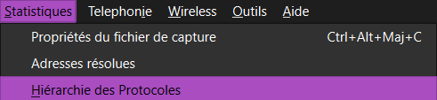
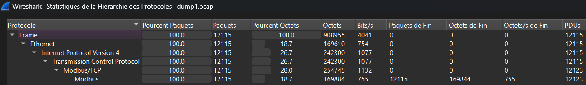

### Shema temporel des flux

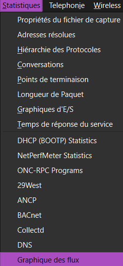

## Etape 1

**Fichier** :  [dump1.pcap](./TP1-pcap/dump1.pcap)

Les étudiants vont ensuite étudier le premier fichier “dump1.pcap” fourni avec
ce TP. Les étudiants devront déterminer :

- Les adresses IP du client et du serveur
  - SCADA
    - IP : `172.27.224.70`
    - MAC : `00:0c:29:9d:9e:9e` : [Lookup](https://maclookup.app/macaddress/000c29)
    - VMware : Machine virtuel ESXI ?
  - PLC
    - IP : `172.27.224.250`
    - MAC : `00:80:f4:09:51:3b` : [Lookup](https://maclookup.app/macaddress/0080f4)
    - TELEMECANIQUE ELECTRIQUE : Schneider
- Le port utilisé par le serveur : `502`
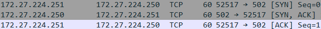
- Le protocole utilisé pour la communication : `Modbus/TCP`
  - Sur un plus grand fichier on aurait pus le deviné avec cette query wireshark : `modbus or s7comm or iec60870_104 or dnp3 or bacnet or enip or cip or opcua or mms or goose or sv`
- Les registres lus par le client sur le serveur
  - `FONCTION 03 (Read) --> Registre 6 value 31`
  - 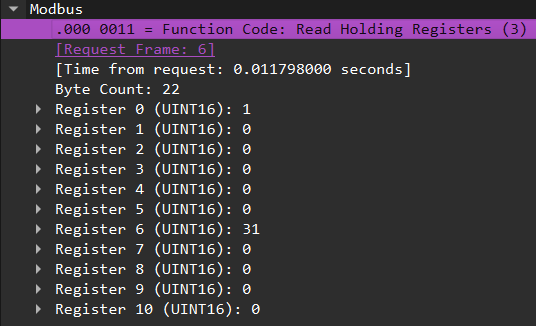
- Les registres écrits par le client
  - `FONCTION 06 (write) --> registre 0 value 30`
  - 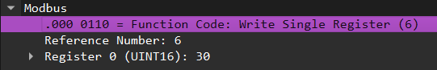
- A quoi pourrait correspondre ce type d’échange ? Echange entre un SCADA (client) vers PLC (serveur)
  - Lecture de registre et écriture de registre, cela permet au SCADA de récupéré des metrics ou d'intéragir avec le PLC.

### Analyse d'un query

Les query sont composé d'un appel a une fonction modbus, le code de cette fonction decrit le mode d'ecriture : [Fonction modubus](https://product-help.schneider-electric.com/ED/ES_Power/NSX_Modbus_Guide/EDMS/DOCA0091FR/DOCA0091xx/NSX_MB_Modbus_Protocol/NSX_MB_Modbus_Protocol-4.htm)

## Etape 2 : dump2.pcapng

**Fichier** :  [dump2.pcapng](./TP1-pcap/dump2.pcapng)

Nous allons passer ensuite à l’analyse du fichier dump2. Une attaque a eu lieu sur un équipement modbus. Plusieurs valeurs de réglages et de commandes
d’un contrôle commande industriel ont été modifiées sur l’automate Schneider. Par chance, les analystes SOC ont pu vous fournir le présent pcap des échanges effectués sur l’infrastructure pour une analyse plus poussée. A
vous désormais de déterminer :

```plain-text
PLC 192.168.1.10 --> SCADA 192.168.1.2O0
PLC 192.168.1.12 --> SCADA 192.168.1.2O2
PLC 192.168.1.11 --> SCADA 192.168.1.2O1
```

- L’adresse IP de la machine ayant exécuté l’ordre : `192.168.1.13`

  - On voit ici qu'il ya une conversation tres courte en temps qui comprend 4 echanges vers le SCADA. Quand on le compare à ses compères les PLC, il ne parait pas très bavard et plutôt suspect.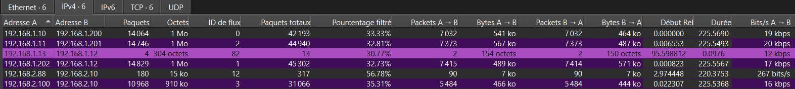
  - On peut verifié les échanges fait par cette ip avec ce filtre wireshark.
`ip.addr == 192.168.1.13`, on réalisera ensuite un shema temporel des flux cf [Schéma temporel des flux](#shema-temporel-des-flux), le ping confirme notre suspection.
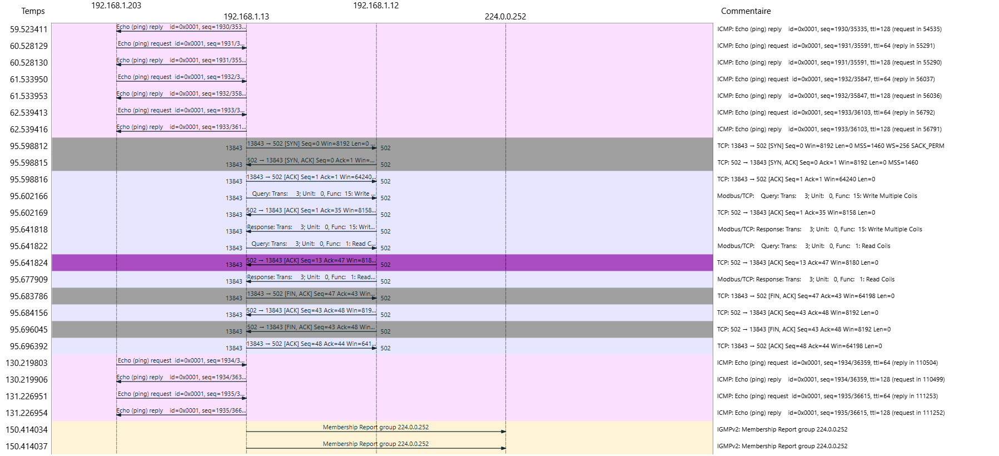

- L’adresse IP de la machine victime et son port : `192.168.1.12:502`
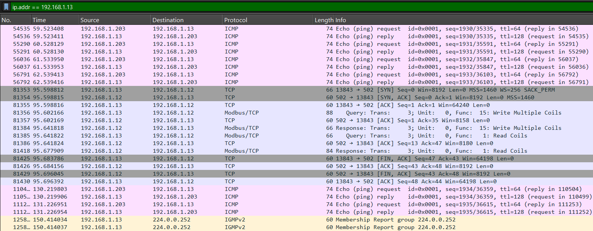
- Le ou les registres touchés (adresse, nombre) : `de bit 16 à 183 <-- 168 registres touchés`
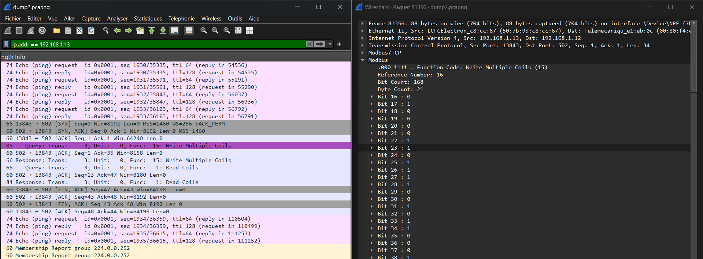
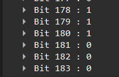
- Le code fonction utilisé : `FONCTION15 (Write Multiple Coils)`
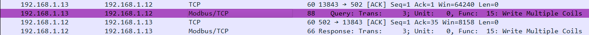
- La valeur du bit 157 lu à la suite du passage de l’ordre. : `0`
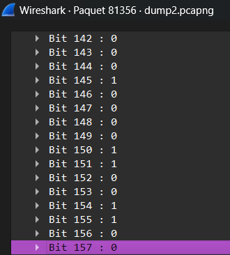

- Quelles sont les valeurs écrites par la supervision sur l’automate Siemens ? Sur quels registres ?  `M 0.1  BIT 1 <-- data : 01`
- Quelle est la fonction utilisée pour écrire les données dans un automate S7comm : `Write Var (0x05)`
- Quelles sont les autres fonctions utilisées ici sur le siemens ? `Read var (0x04) Setpup communication (0xf0)`
  - [setup a Read_Var](https://www.se.com/be/fr/faqs/FA359633/)

## Etape 3 : dump3.pcapng

[dump3.pcapng](./TP1-pcap/dump3.pcap)

**Filtre wireshark**  : `!(_ws.col.protocol == "TCP")`

- Quel est le protocole utilisé sur cette attaque ? `iec60870_104` ou pour les intimes de l'industriel `iec 104`.
  - TCP
  - Le ce protocole est une extension du protocole IEC 101, avec des modifications au niveau des couches de transport, réseau, liaison et physique pour permettre un accès réseau complet.
  - Bien que le protocole IEC 104 présente des problèmes de sécurité similaires à d'autres protocoles SCADA de son époque, une norme de sécurité, IEC 62351, a été développée pour y remédier, mais sa complexité et son coût freinent son adoption.
  - [Description and analysis of IEC 104 Protocol](https://www.fit.vut.cz/research/publication-file/11570/TR-IEC104.pdf)
- Quelle est la cible de l’attaque (IP:Port) : `10.82.40.105:2404`
- Quelles sont les fonctions appelées pour attaquer l’installation ? :

  - **U(TESTFR act)**
    - **Description** : Ce message est utilisé par le maître (station de contrôle) pour tester la liaison de communication avec l'esclave (dispositif de terrain).
    - **Fonction** : Il s'agit d'une commande d'activation (act) pour vérifier si la liaison de communication est opérationnelle.

  - **U(TESTFR con)**
    - **Description** : Message est utilisé par l'esclave pour confirmer la réception du message U(TESTFR act) envoyé par le maître.
    - **Fonction** : Il s'agit d'une confirmation (con) indiquant que la liaison de communication est opérationnelle et que le message de test a été reçu correctement.

  - **U(STARTDR act)**
    - **Description** : Message est utilisé par le maître pour demander à l'esclave de démarrer la transmission de données de manière cyclique.
    - **Fonction** : Il s'agit d'une commande d'activation (act) pour initier la transmission cyclique de données depuis l'esclave vers le maître.

- **U(STARTDT con)**
  - **Description** : Message est utilisé par l'esclave pour confirmer la réception du message U(STARTDR act) envoyé par le maître.
  - **Fonction** : Il s'agit d'une confirmation (con) indiquant que l'esclave a reçu la commande de démarrage de la transmission cyclique de données.

    
    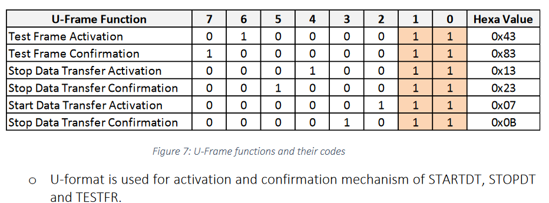

- **I**
  - **Description** : Messages d'information envoyés par l'esclave au maître.
  - **Fonction** : Ces messages contiennent des données de mesure, des états binaires, des événements, etc., qui sont transmis de manière cyclique ou spontanée.

- **S**
  - **Description** : Messages de supervision envoyés par l'esclave au maître.
  - **Fonction** : Ces messages contiennent des informations  telles que des états de communication, des erreurs, des alarmes, etc.

    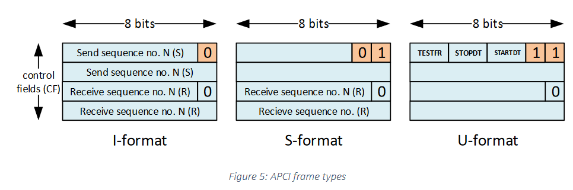

- Quels sont les registres ciblés et les valeurs passées :  
???? Pas fait zbi
- Qui est l’attaquant et comment s’appelle le malware?

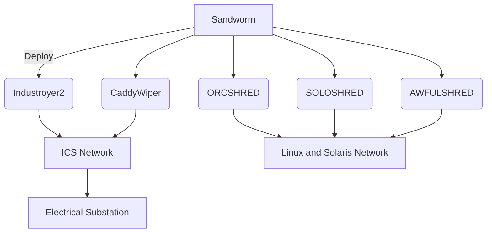


- Attaquant : Sandworm
  - Malware : Industroyer2
  - Reverse du malware fait par Eset : [Win32_industroyer.pdf](./Win32_Industroyer.pdf)
  - [Teams 82 article](https://claroty.com/team82/blog/industroyer2-variant-surfaces-in-foiled-attack-against-ukraine-electricity-provider)
  - Virus total
    - <https://www.virustotal.com/gui/file/893e4cca7fe58191d2f6722b383b5e8009d3885b5913dcd2e3577e5a763cdb3f/detection>
    - <https://www.virustotal.com/gui/file/21c1fdd6cfd8ec3ffe3e922f944424b543643dbdab99fa731556f8805b0d5561/detection>
    - <https://www.virustotal.com/gui/file/3e3ab9674142dec46ce389e9e759b6484e847f5c1e1fc682fc638fc837c13571/detection>
    - <https://www.virustotal.com/gui/file/ad23c7930dae02de1ea3c6836091b5fb3c62a89bf2bcfb83b4b39ede15904910/detection>
    - <https://www.virustotal.com/gui/file/37d54e3d5e8b838f366b9c202f75fa264611a12444e62ae759c31a0d041aa6e4/detection>
    - <https://www.virustotal.com/gui/file/7907dd95c1d36cf3dc842a1bd804f0db511a0f68f4b3d382c23a3c974a383cad/detection>

- Quand est-ce que le malware est apparue pour la 1er fois ?
  - Avril 2022
  - *The Windows executable named “108_100.exe” had instructions to launch on April 8, 2022, precisely at 16:10 UTC.* <https://www.headmind.com/industroyer-2/>

```log
2022-02-24: Beginning of the current Russian invasion in Ukraine
2022-03-14: Deployment of CaddyWiper against a Ukrainian bank
2022-04-01: Deployment of CaddyWiper against a Ukrainian governmental entity
2022-04-08 14:58 UTC: Deployment of CaddyWiper on some Windows machines and of Linux and Solaris destructive malware at the energy provider
2022-04-08 15:02:22 UTC: Sandworm operator creates the scheduled task to launch Industroyer2
2022-04-08 16:10 UTC: Scheduled execution of Industroyer2 to cut power in an Ukrainian region
2022-04-08 16:20 UTC: Scheduled execution of CaddyWiper on the same machine to erase Industroyer2 traces
```

## Bonus

### Pour toujours plus de pcap <3

<https://github.com/eset/malware-research/tree/master/industroyer2>

### Stack-overflow du PLC

<https://www.plctalk.net>

### plcsimulator.net

- Une UX/UI 10/10 pour les mec des automates

- La légende raconte que le site tourne sur un PLC des année 30, il mis un proxy https sur le port 502.

- Ne pas mettre un mot trop compliqué dans la bar de recherche au risque de faire tomber le site.

- *Learn quickly with our PLC Training DVD Series: on sale ~~$599.00~~ => $379 !!!!!!!*

- Si qqn a la fois de mettre son email pour le simulateur je veux bien

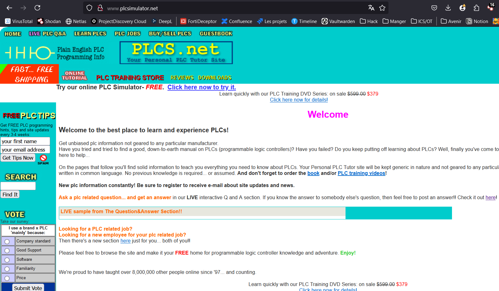

### Module metasploit pour modbus

<https://github.com/rapid7/metasploit-framework/blob/master/modules/auxiliary/scanner/scada/modbusclient.rb>

### OSINT ICS/OT

Mettre un proxy [Segfault](https://www.thc.org/segfault/) / VPS seft hosted [Wireguard](https://www.wireguard.com/) sur un VPS / VPN [Mullvad](https://mullvad.net/fr) / Lancer un firefox sur un docker pour ne pas etre flag par son fingerprint.

<https://www.icsrank.com/>

### Fun fact

On peut voir ici l'identifiant commun entre le SCADA et le PLC, si il est different ca ne marche pas, c'est une sorte de ""sécurité"". Il est possible de brutforce le PLC jusqu'a ce qu'il parle en modbus.

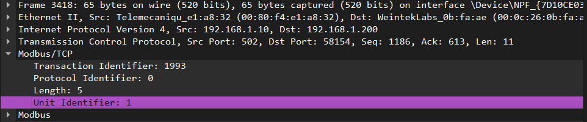
